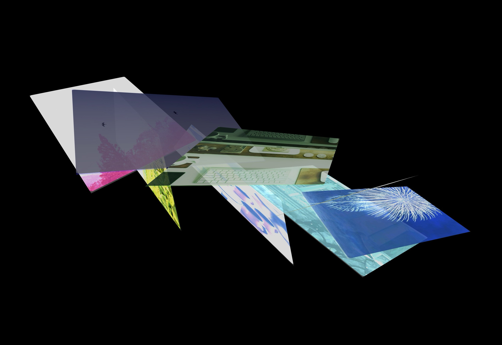

# Cover Shows Soothing Scroller Demo Project

## مشروع عرض سلس مهدئ لبعض صور البرامج الإذاعية

## مقدمة

مرحبًا بك في مشروع Demo Scroll Shows الخاص بنا! هذا المشروع يضم مكونًا ديناميكيًا وتفاعليًا بالهول، والذي يستطيع عرض سلسلة من الصور بشكل جذاب بصريًا. يدعم أيضًا وضع العرض، حيث تتغير الصور تلقائيًا كل بضع ثوانٍ عندما لا تتحرك الفأرة.

## الميزات

- دوران وموضع الصور الديناميكي بناءً على حركة الفأرة
- دوران الصور التلقائي لوضع العرض الجذاب عندما لا تتحرك الفأرة
- تخطيط تكيفي ليتناسب مع أحجام الشاشات المختلفة
- مكون سهل الاستخدام وقابل للتخصيص لتحسينات مستقبلية

## التثبيت

1. قم بإنشاء نسخة محلية من هذا المشروع على جهازك الشخصي باستخدام `git clone` أو قم بتنزيل ملف ZIP.
2. افتح دليل المشروع في محرر الكود الذي تفضله.
3. لا تتطلب التثبيت خطوة إضافية، لأن جميع الاعتماديات الضرورية مضمنة داخل ملفات المشروع.

## الاستخدام

لاستخدام والتفاعل مع مكون الهول، قم بفتح ملف `index.blade.php` في متصفح ويب. يمكنك تجربة تنقل الصور باستخدام الفأرة، أو الانتظار حتى يغير وضع العرض الصور تلقائيًا كل بضع ثوانٍ. الصور المعروضة مُعرَّفة داخل مصفوفة `IMAGES` ضمن JavaScript code في `index.blade.php`.

## هيكل المستندات

- `/templates`: يحتوي على جميع ملفات HTML templates، بما في ذلك ملف `index.blade.php` الرئيسي الذي يشمل مكون الهول وأنماطه وأنظمته المقابلة.

## المساهمة

المساهمات في هذا المشروع مرحب بها! إذا كانت لديك أي استفسارات أو اقتراحات لتحسين، فلا تتردد في فتح مشكلة أو إرسال طلب سحب على مستودع GitHub.

## الرخصة

هذا المشروع مُرخَّص بموجب ترخيص MIT. راجع ملف [LICENSE](LICENSE) لمزيد من التفاصيل.

---
#### برمجة وتصميم المهندس/ حسن الدّوي @aldoyh 2025